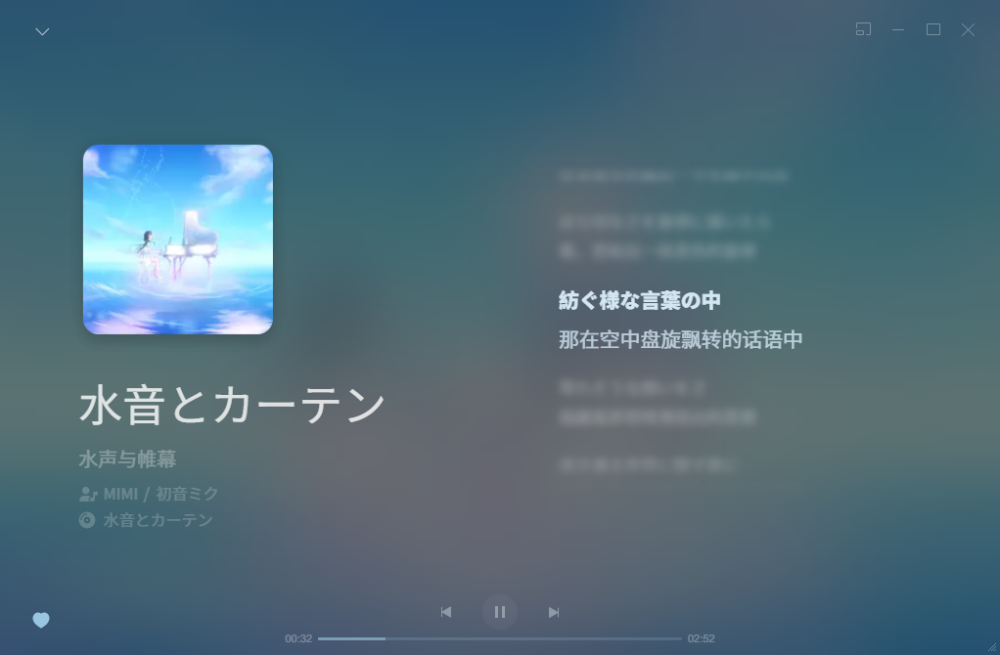
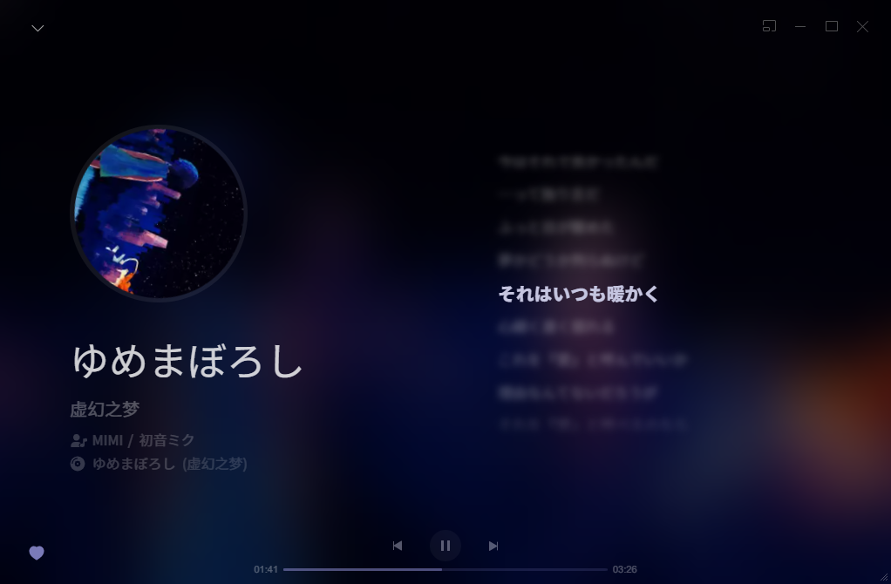

# refined-now-playing-netease
一个美化网易云音乐播放界面的 [BetterNCM](https://github.com/MicroCBer/BetterNCM) 插件

# 安装

0. 安装 [BetterNCM](https://github.com/MicroCBer/BetterNCM) 插件
1. 从 [Releases](https://github.com/solstice23/refined-now-playing-netease/releases) 下载或直接克隆本 Repo
2. 将 `RefinedNowPlaying` 文件夹放到 `C:\Users\admin\betterncm\plugins_dev\` 下
3. 重启网易云

# 效果

https://user-images.githubusercontent.com/23134847/202904157-74c344c9-a3de-44d4-bc49-bf502e12232c.mp4

